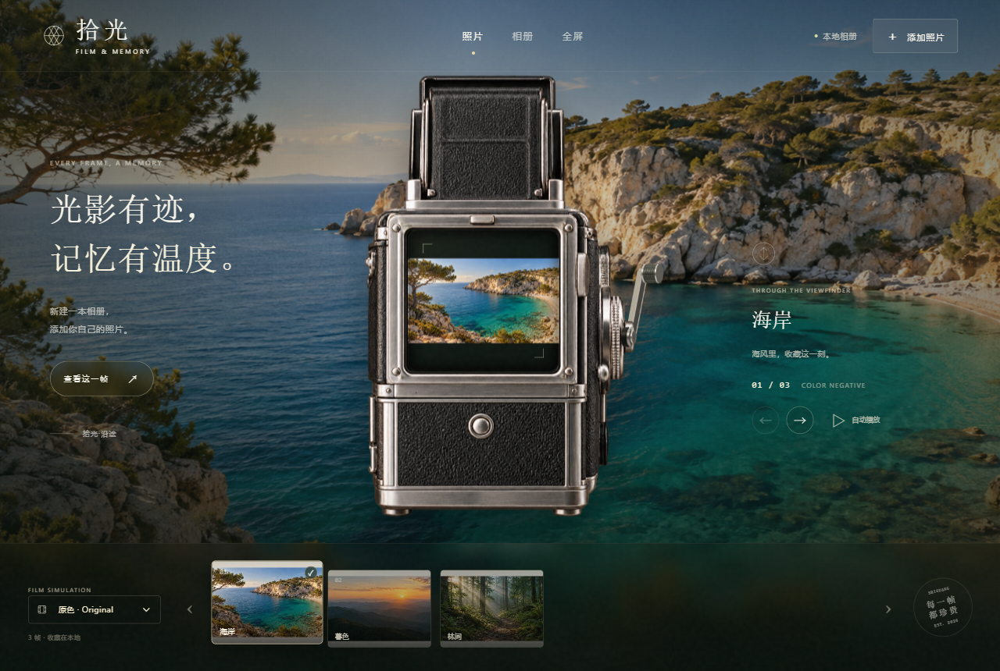
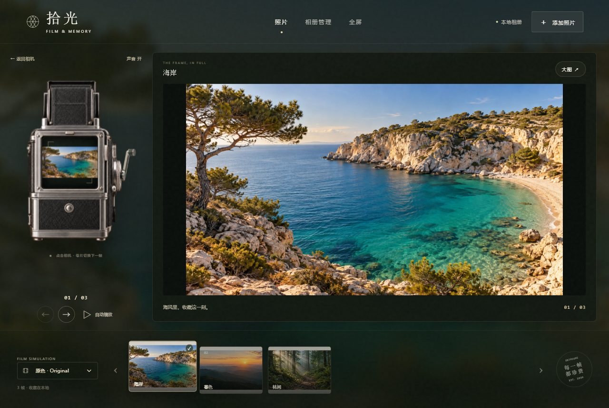

# 拾光胶片 · Shiguang Film

**把照片收进一台会卷片的胶片机。**

拾光胶片是一款面向 Windows 的开源本地照片相册。它将复古相机、3D 卷片动作、机械音效与照片浏览结合起来：点击相机，卷片杆绕侧轴转动，随后进入下一张照片；相机移至左侧，右侧完整展示照片，让每一次回看都有一点仪式感。

你可以用它整理旅行、日常记录或摄影作品：新建相册，自行添加照片、调整顺序、写下说明，再用胶片风格慢慢浏览。相册保存在你选择的电脑文件夹中，安装后的核心功能可以离线使用。

**首次启动为空相册。用户自行添加照片并选择保存位置，仓库与安装包不附带任何私人照片。**

[**下载 Windows 版**](https://github.com/semeyd/shiguang-film/releases/latest) · [相册存储说明](docs/storage-format.md) · [反馈问题](https://github.com/semeyd/shiguang-film/issues) · [MIT License](LICENSE)

## 10 秒演示

真实软件操作录屏：相机首页 → 点击卷片 → 切换照片 → 左右分区浏览。视频包含原创 BGM、机械卷片音效和中文标题。

https://github.com/user-attachments/assets/506f1f46-bb6c-4615-a0a6-e0b975b08239

[下载完整 MP4（含声音）](https://github.com/semeyd/shiguang-film/releases/download/v0.4.0/shiguang-film-promo-10s.mp4) · [仓库内的视频文件](docs/media/shiguang-film-promo-10s.mp4)

演示使用 AI 生成的海岸、暮色和森林风景。演示相册仅用于拍摄宣传片，实际安装后需要添加自己的照片。

## 界面预览

### 复古相机与胶片导航

照片出现在相机取景框中，底部胶片列表可直接选择照片；点击相机则播放卷片动作并推进一帧。



### 左侧相机，右侧完整照片

进入浏览模式后，相机位于左侧约四分之一区域，右侧约四分之三用于展示照片。照片按比例完整适配，也可以打开大图或进入窗口全屏。



## 功能一览

| 功能 | 当前支持 |
| --- | --- |
| 相机卷片 | 固定侧轴的 3D 卷片动作、机械音效与声音开关。 |
| 连续浏览 | 点击相机推进一张，末张循环回首张；卷片期间阻止连点造成跳图。 |
| 照片导航 | 底部胶片列表、前后按钮、左右方向键及自动播放。 |
| 大图展示 | 左右分区、完整比例适配、独立大图查看及窗口全屏。 |
| 胶片色调 | 原色、暖调和黑白；色调仅影响显示。 |
| 相册编辑 | 增添照片、调整顺序、顺时针 90° 旋转、简短说明与相册代表照片。 |
| 保存与恢复 | 自动保存、手动保存、最近打开列表及恢复选中的照片。 |
| 图片格式 | JPEG、PNG、WebP，以及 Nikon NEF 的内嵌 JPEG 预览。 |
| 文件夹迁移 | 相册内部使用相对路径，整体复制或移动后可以重新打开。 |

## 下载与快速开始

### 安装

1. 打开 [Releases 下载页](https://github.com/semeyd/shiguang-film/releases/latest)。
2. 下载 `ShiguangFilm-Setup-版本号-x64.exe`，完成安装后打开“拾光胶片”。
3. 最终用户无需安装 Node.js、开发工具或手动启动服务。

目标平台为 **Windows 10/11 x64**；当前实际验收系统为 Windows 11 x64。

### 添加你的第一本相册

1. 点击“添加照片”，或进入“相册管理 → 新建相册”。
2. 填写相册名称，选择电脑上的保存位置。
3. 点击“添加照片”，批量选择需要收进相册的图片。
4. 点击相机，听着卷片声切换下一张；也可使用底部胶片、箭头或左右方向键。
5. 在“相册管理”中调整顺序、旋转照片或填写说明。以后通过“最近打开”或“打开相册”继续浏览和编辑。

## 照片保存在哪里？

**相册保存位置由你选择，安装位置与相册位置分开。** 应用不会把相册写死在开发者的磁盘或目录中。

```text
你选择的文件夹/
└─ 我的相册/
   ├─ photobook.json        # 顺序、说明、旋转、色调和浏览位置
   ├─ photobook.json.bak    # 保存时尝试保留的上一份描述文件
   ├─ photos/              # 原图副本及 NEF 的 JPEG 预览
   ├─ thumbnails/          # 界面缩略图
   └─ pages/               # 旧格式兼容目录，当前不生成书页
```

- **导入方式：** 将照片复制到相册文件夹，并校验文件大小和 SHA-256。来源照片不会被覆盖；来源文件随后被移动，相册仍可使用自己的副本。
- **显示与编辑：** 色调、旋转和说明保存为相册参数，不覆盖导入的原图。
- **移除照片：** 从相册取消登记，保留来源文件及相册中的副本；保留的文件仍占用磁盘空间。
- **备份与迁移：** 复制整个相册文件夹，在新位置使用“打开相册”重新选择它。
- **应用设置：** 最近相册、会话、日志和缓存位于当前 Windows 用户应用数据目录中的 `ShiguangFilm`，与相册分开。
- **本地使用：** 没有账号、云同步或照片上传功能；照片导入、保存、浏览和编辑可断网使用。

相册文件夹可能包含原始照片的 EXIF、原文件名和你填写的说明。详细字段、NEF 预览及保存行为见 [相册存储格式](docs/storage-format.md)。

## 常见问题

### 为什么刚打开没有照片？

这是正常的。公开版不预装相册，也不读取开发者的照片目录，请先新建相册并添加自己的照片。

### NEF 能否完整显影？

当前通过相机写入的内嵌 JPEG 浏览 NEF，不进行 RAW 显影。预览分辨率和色彩取决于相机；没有有效内嵌 JPEG 的 NEF 无法导入，其他有效照片仍可继续导入。

### 移动相册后，最近列表打不开怎么办？

通过“打开相册”选择新位置的整个相册文件夹。备份时应同时保留描述文件、原图与预览，不只复制 `photobook.json`。

### 暖调和黑白会修改原片吗？

不会。它们是显示效果，旋转也只记录参数。当前没有 RAW 调色、照片修图或带滤镜图片导出功能。

## 从源码运行

建议在 Windows 开发。需要 **Node.js 22.12 或更高版本**，推荐 Node.js 24 LTS。

```powershell
git clone https://github.com/semeyd/shiguang-film.git
cd shiguang-film
npm ci
npm run dev
```

`npm run dev` 同时启动 Vite 界面和 Electron 桌面窗口。`npm run web` 用于界面预览，本地文件导入需要桌面窗口。

### 构建与验证

```powershell
npm run build
npm test
npm run dist:win
```

- 安装包输出至 `release/`。
- 测试在 `.test-data/` 中生成合成图片，报告保存于 `test-output/`；这些目录不提交到仓库。
- 首版已在 Windows 11 x64 完成 18 项隔离验证，覆盖空相册首启、照片导入、卷片动作、音效、保存、重新打开、迁移和离线浏览。测试方法见 [测试说明](tests/README.md)。
- [GitHub Actions](https://github.com/semeyd/shiguang-film/actions/workflows/windows.yml) 在 Windows 上构建和验证；推送与版本号匹配的 `v*` 标签可生成发行版。

### 项目结构

```text
electron/       桌面窗口、文件访问与 NEF 预览提取
src/            相册管理、浏览界面与三维卷片
public/film/    相机、背景与卷片音效
docs/           数据格式、界面截图与宣传视频
tests/          使用合成图片的桌面验收
.github/        Windows 构建与发行工作流
```

## 技术、贡献与授权

应用基于 **Electron、Vite、原生 JavaScript 和 Three.js**。卷片杆采用三维刚性几何与深度遮挡，提供 Canvas2D 投影降级；空闲时不持续绘制。

欢迎通过 [Issues](https://github.com/semeyd/shiguang-film/issues) 提交问题或建议。报告问题时，请说明系统版本、复现步骤、图片格式及错误提示；截图和测试资料由你自行选择分享。

项目采用 [MIT License](LICENSE)。初始照片书理念参考 [create-photo-flipbook-ui](https://github.com/HaichaoLihc/create-photo-flipbook-ui)，目前界面为胶片相机，未使用原书页阅读器。原版权声明见 [REFERENCE_LICENSE.txt](REFERENCE_LICENSE.txt)，组件与应用素材说明见 [THIRD_PARTY_NOTICES.md](THIRD_PARTY_NOTICES.md)。

宣传视频的配乐为本项目原创合成音乐，演示风景为 AI 生成素材，不含用户私人相册。[宣传素材说明](docs/media/README.md)
