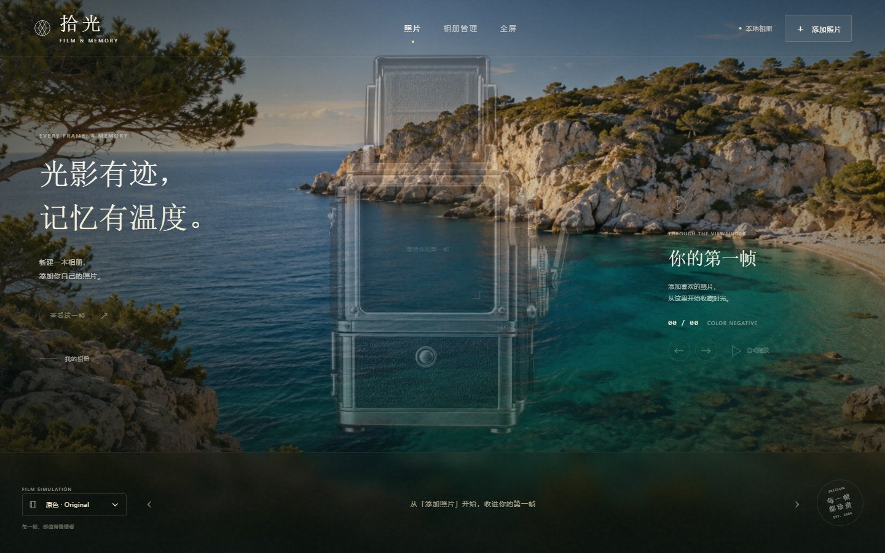

# 拾光胶片 · Shiguang Film

一个在 Windows 本地运行的照片相册。点击复古相机，三维卷片杆转动一圈后进入下一张照片；左侧约四分之一展示相机，右侧完整展示照片。

**发行版不含任何用户照片。首次启动为空相册，由你选择保存位置并添加自己的照片。**



## 下载和使用

前往 [Releases](https://github.com/semeyd/shiguang-film/releases/latest) 下载 Windows 64 位安装包。最终用户不需要 Node.js 或开发工具。

1. 安装并打开“拾光胶片”。
2. 点击“添加照片”或“相册管理 → 新建相册”。
3. 填写相册名称，选择自己电脑上的保存文件夹。
4. 点击“添加照片”，批量选择照片。
5. 点击相机卷片切换下一张；也可使用底部胶片、箭头和左右方向键。

## 功能

- 固定侧轴的三维卷片动作、机械音效及声音开关。
- 点击相机推进一张，最后一张循环回第一张，卷片期间防止连点跳图。
- 左右分区、大图查看、窗口全屏、自动播放。
- 原色、暖调、黑白浏览效果。
- 照片排序、90°旋转、简短说明和自动保存。
- JPEG、PNG、WebP、Nikon NEF。NEF 使用内嵌 JPEG 预览，不进行 RAW 显影。
- 相册文件使用相对路径，可整体移动文件夹后重新打开。

## 照片和隐私

- 原始照片复制到你选择的相册文件夹，并进行大小和 SHA-256 校验。
- 裁切背景、色调和旋转只影响显示或编辑参数，不覆盖导入来源照片。
- 从相册移除照片只取消登记，保留原图副本。
- 照片保存在本地，不上传到服务器；核心浏览和编辑功能可断网使用。
- 应用设置、最近相册列表、缓存和日志存入当前用户的应用数据目录。
- 仓库与安装包只含应用代码、原创合成声音和 AI 生成的相机/背景素材，未内置开发者的相册、照片、缩略图或最近记录。

详细格式见 [相册存储说明](docs/storage-format.md)。

## 从源码运行

需要 Node.js 22.12 或更高版本，推荐 Node.js 24 LTS。

```powershell
git clone https://github.com/semeyd/shiguang-film.git
cd shiguang-film
npm ci
npm run dev
```

`npm run dev` 会一起启动界面和 Electron 桌面窗口。`npm run web` 仅用于界面预览，本地文件导入需要桌面窗口。

## 构建和测试

```powershell
npm run build
npm test
npm run dist:win
```

Windows 安装包输出到 `release/`。测试只在 `.test-data/` 内生成合成照片，报告位于 `test-output/`；这些目录均不提交到仓库。

GitHub Actions 在 Windows 上构建和验证；推送 `v*` 标签可生成发行版。目标平台为 Windows 10/11 x64，本次实际验收系统为 Windows 11 x64。

## 技术与授权

Electron、Vite、原生 JavaScript 和 Three.js。曲柄使用三维刚性几何、深度遮挡及 Canvas2D 投影降级；空闲时不持续绘制。

项目使用 [MIT License](LICENSE)。初始照片书理念参考 [create-photo-flipbook-ui](https://github.com/HaichaoLihc/create-photo-flipbook-ui)；当前界面为胶片相机，未使用原书页阅读器。原版权声明见 [REFERENCE_LICENSE.txt](REFERENCE_LICENSE.txt)，组件说明见 [THIRD_PARTY_NOTICES.md](THIRD_PARTY_NOTICES.md)。

